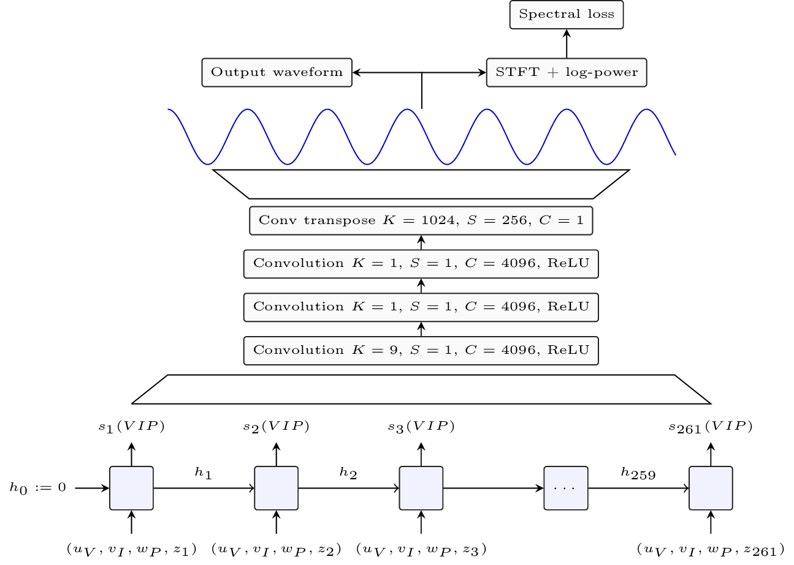

# SING: Symbol-to-Instrument Neural Generator

SING is a deep learning based music notes synthetizer that can be trained on the
 [NSynth dataset][nsynth].
Despite being 32 times faster to train and 2,500 faster for inference,
SING produces audio with significantly improved perceptual quality compared to
the NSynth wavenet-like autoencoder [[1]](#ref_nsynth) as measured by
Mean Opinion Scores based on human evaluations.

The architecture and results obtained are detailed in our paper
[SING: Symbol-to-Instrument Neural Generator][sing_nips].
SING is based on a LSTM based sequence generator and a
convolutional decoder:

<p align="center">
</p>


## Requirements

SING works with python3.6 and newest.
To use SING, you must have decently recent version of the following
package installed:

- numpy
- requests
- pytorch (needs to be >= 4.1.0 as we use torch.stft)
- scipy
- tqdm

If you have anaconda installed, you can run from the root of this repository:

    conda env update
    conda activate sing

This will create a `sing` environmnent with all the dependencies installed.
Alternatively, you can use pip to install those:

    pip3 install -r requirements.txt


SING can optionally be installed using the usual `setup.py`
although this is not required.

### Obtaining the NSynth dataset

If you want to train SING from scratch, you will need a copy of the NSynth
dataset [[1]](#ref_nsynth). To download it, you use the following instructions
(WARNING, NSynth is 30GB so this will take a bit of time):

    mkdir data && cd data &&\
    wget http://download.magenta.tensorflow.org/datasets/nsynth/nsynth-train.jsonwav.tar.gz &&\
    tar xf nsynth-train.jsonwav.tar.gz


## Using SING

Once installed or from the root of this repository, you can use a family
of commands detailed hereafter of the form

    python3 -m sing.*


### Common flags

For either training or generation, use the `--cuda` flag for GPU acceleration
and `--parallel` flag to use all available GPUs. Depending on the memory
and number of GPUs available, consider tweaking the batch size using the
`--batch-size` flag. The default is 64 but 256 was used in the paper.


### Training

If you already have the NSynth dataset downloaded somewhere, run

    python3 -m sing.train [--cuda [--parallel]] --data PATH_TO_NSYNTH \
        --output PATH_TO_SING_MODEL [--checkpoint PATH_TO_CHECKPOINTS]

`PATH_TO_NSYNTH` is by default set to `data/nsynth-train`.
The final model will be saved at `PATH_TO_SING_MODEL`. If you want
to save checkpoints after each epoch, or to resume a previously interrupted
training, use the `--checkpoint` option.

By default, `PATH_TO_NSYNTH` is set to `data` and `PATH_TO_SING_MODEL`
is set to `models/sing.th`.

### Generation

For generation, you do not need the NSynth dataset but you should have a trained SING model.

    python3 -m sing.generate [--cuda [--parallel]] \
        --model PATH_TO_SING_MODEL PATH_TO_ITEM_LIST

`PATH_TO_ITEM_LIST` should be a file with one dataset item name per list,
for instance `organ_electronic_044-055-127`.

Alternatively, you can download a pretrained model using

    python3 -m sing.generate [--cuda [--parallel]] --dl PATH_TO_ITEM_LIST

By default, the model will be downloaded under `models/sing.th` but a
different path can be provided using the `--model` option.
The pretrained model can be directly download [here](https://s3.amazonaws.com/sing-models/sing.th).

### Results reproduction

To reproduce the results of Table 1 in our paper, simply run

```bash
# For the L1 spectral losss
python3 -m sing.train [--cuda [--parallel]] --l1
# For the L1 spectral loss without time embeddings
python3 -m sing.train [--cuda [--parallel]] --l1 --time-dim=0
# For the Wav loss
python3 -m sing.train [--cuda [--parallel]] --wav
```

To reproduce the audio samples used for the human evaluations, simply run
from the root of the git repository

    python3 -m sing.generate [--cuda [--parallel]] --dl nsynth_100_test.txt

The file `nsynth_100_test.txt` has been generated using the following code:

```python
from sing import nsynth
from sing.fondation.datasets import RandomSubset
dset = nsynth.get_nsynth_metadata()
train, valid, test = nsynth.make_datasets(dset)

evaluation = RandomSubset(test, 100)
open("nsynth_100_test.txt", "w").write("\n".join(
    evaluation[i].metadata['name'] for i in range(len(evaluation))))
```

## Generated audio

A comparison of audio samples generated by SING and the NSynth Wavenet based autoencoder [[1]](#ref_nsynth)
is available on [the paper webpage](https://research.fb.com/publications/sing-symbol-to-instrument-neural-generator).


## Thanks

We thank the Magenta team for their inspiring work on NSynth.

## License

For conveniance we have included a copy of the metadata of the NSynth dataset
in this repository. The dataset has been released by Google Inc
under the Creative Commons Attribution 4.0 International (CC BY 4.0) license.

SING is released under Creative Commons Attribution 4.0 International
(CC BY 4.0) license, as found in the LICENSE file.

## Bibliography

<a name="ref_nsynth"></a>[1]: Jesse Engel, Cinjon Resnick, Adam Roberts,
Sander Dieleman, Douglas Eck,
  Karen Simonyan, and Mohammad Norouzi. [Neural Audio Synthesis of Musical Notes with WaveNet Autoencoders](https://arxiv.org/pdf/1704.01279.pdf). 2017.


[nsynth]: https://magenta.tensorflow.org/datasets/nsynth
[sing_nips]: https://research.fb.com/publications/sing-symbol-to-instrument-neural-generator
